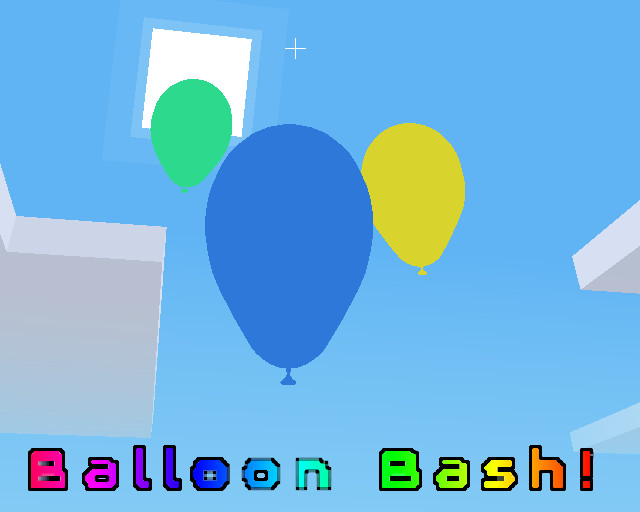

**From LDJAM 50**

To play the preconfigured one for the JAM (WINDOWS) go [here](https://u.pcloud.link/publink/show?code=kZlGM5VZ7Upvx5SCYLRdApqFHaTvnjsd3w0y)

# Setup!

Use world edit mod, and lay down some ground from -100,0,-100 to 100,0,100. //1, //2, //set ground

Then rejoin, after disabling world_edit

# Single Player:

Delay the inevitable: keep the balloon(s) off the ground!

1. walk with WASD
2. jump with spacebar
3. punch the balloon with left click!

Try to get as many balloons as possible :)

# Multiplayer!!!

Yes it supports normal minetest multiplayer, enjoy!

# Other notes

IF YOU FALL OFF (fue fue fue), just quit and come back :)